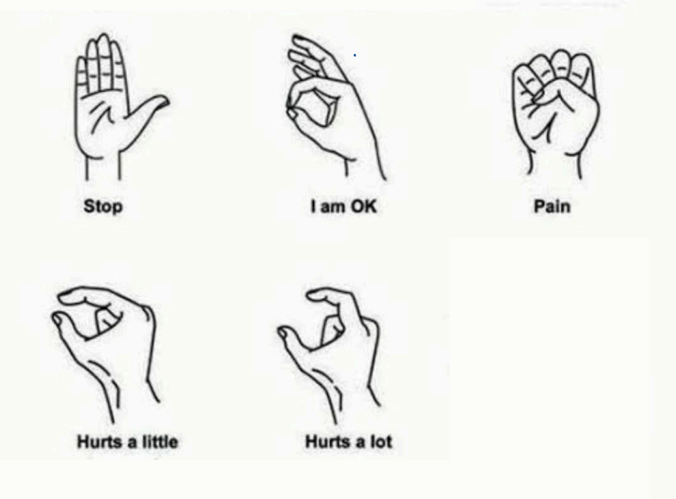

# ✋ Hand Gesture to Speech

This software is designed for **deaf and hard-of-hearing people**.  
It uses a webcam to detect **hand gestures** with MediaPipe Hands, and then converts recognized gestures into **spoken words** using text-to-speech.  

---

## ⚡ Requirements
- Python 3.8+
- Works on Windows, macOS, Linux
- Python packages:
  - mediapipe
  - opencv-python
  - numpy
  - pywin32 (Windows only, for speech)

---

## 🔧 Installation
Clone the repository and install dependencies:

```sh
pip install -r requirements.txt
```

---

## ▶️ How to Use
Run the application:

```sh
python app.py
```

- The webcam will open automatically.  
- Show your hand gestures in front of the camera.  
- The system will recognize the gesture and speak it aloud.  
- Press ESC to exit the program.  
<p align="center">
  
</p>

---

## 📝 Notes
- Coordinates of fingertips are measured relative to the thumb.  
- For Windows stability, the app uses `cv2.VideoCapture(0, cv2.CAP_DSHOW)`.  
- If the camera doesn’t open, try another device index:  

```sh
python app.py --device 1
```

---

